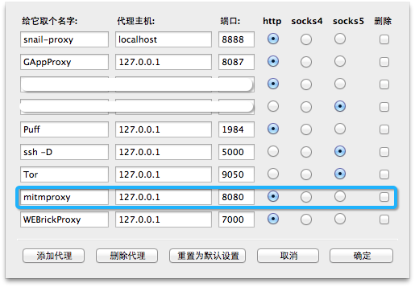
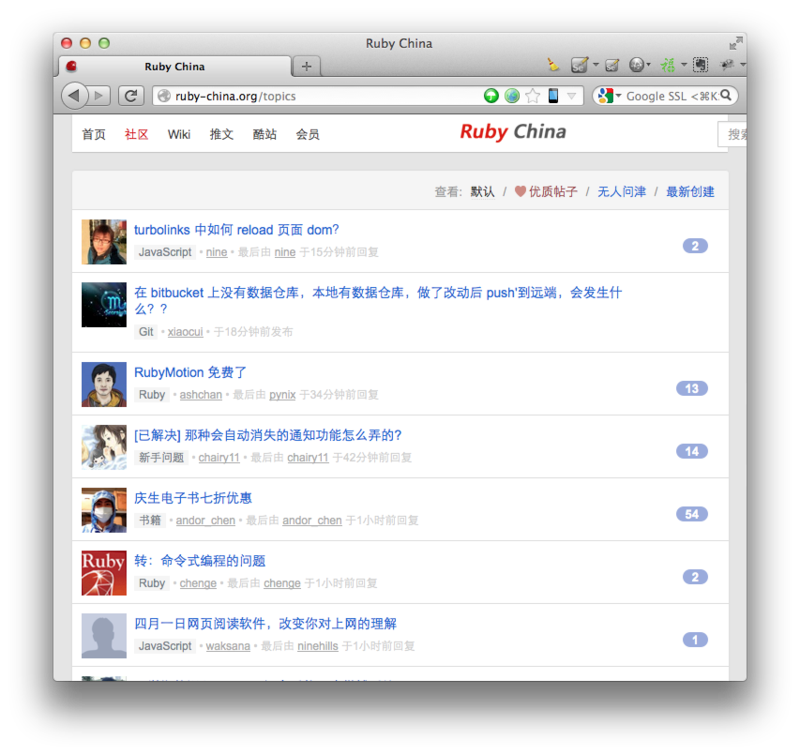
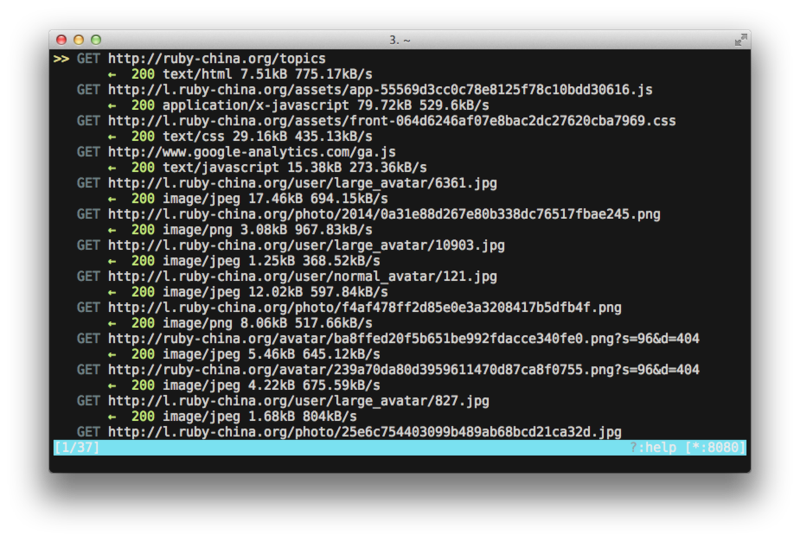
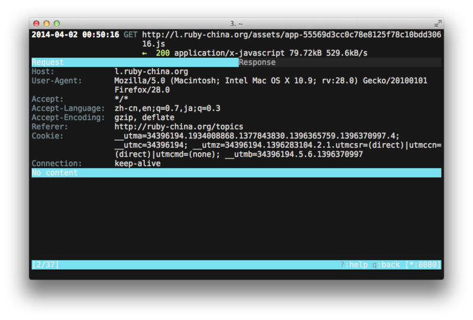

Web 开发者经常需要通过查看页面被打开之后所发送的请求来调试自己开发的程序，现代浏览器，包括 Firefox, Chrome, Safari 都自带了开发工具，可以帮助开发者监控 HTTP 请求。但是有时候这些工具仍不能满足我们的需求，例如在做某些古老的浏览器(IE)上的兼容性调试时，就需要一个专门用于监控 HTTP 请求的工具才行。最近发现了一个强大的 HTTP 请求监控工具 ———— `mitmproxy`    [Home Page](http://mitmproxy.org/index.html)。

#### 1. 介绍

mitmproxy 是用 Python 和 C 开发的一个中间人代理软件（man-in-the-middle proxy），它可以用来拦截、修改、重放和保存 HTTP/HTTPS 请求。

它提供了两个命令行工具：

+ `mitmproxy` 具备交互界面
+ `mitmdump` 不具备交互界面，类似 tcpdump

本文只介绍 `mitmproxy`。

mitmproxy 支持两种工作模式：

+ HTTP 代理模式，也就是 mitmproxy 作为一个 HTTP 代理运行，类似于 HTTPSpy。
+ 透明模式，mitmproxy 通过 iptables/pf 作为一个 TCP 层代理运行，好处是不需要修改 HTTP 客户端的配置。

本文只介绍 HTTP 代理模式。

#### 2. 安装

使用 `pip` 进行安装：

```sh
pip install mitmproxy
```

考虑到包括我朝在内的四大文(读作：zhuān)明(读作：zhì)国家所特有的网络环境，pip可能会出现网络连接超时等错误，可以加上 `--proxy` 选项:

```sh
pip install mitmproxy --proxy=127.0.0.1:8087
```

我在 OS X Mavericks 上安装还会遇到一个编译错误，可以通过添加 `ARCHFALGS` 环境来忽略此错误：

```sh
ARCHFLAGS=-Wno-error=unused-command-line-argument-hard-error-in-future pip install mitmproxy --proxy=127.0.0.1:8087
```

#### 3. HTTP 客户端配置

mitmproxy 安装完成之后，默认以 HTTP 代理模式工作，就需要 HTTP 客户端将代理配置修改为 mitmproxy 的地址。

```sh
# 启动 mitmproxy:
# 使用 -p 选项指定 HTTP 代理所监听的端口号，默认为 8080
mitmproxy -p 8080
```

以 Firefox + AutoProxy 插件为例，客户端的配置如下：




#### 4. 请求列表

在 Firefox 中打开一个网页，如：http://ruby-china.org/topics



可以在 mitmproxy 中看到一个 HTTP 请求的列表：



在 mitmproxy 中可以按 `?` 进入到帮助信息界面，如需返回到请求列表界面则按 `q`。

在请求列表界面，黄色的箭头 `>>` 指示当前选择的请求，可以使用 vi 的快捷键 `k`, `j` 来移动箭头，`PgUp`、`PgDown` 为上下翻页，此外空格键也可用来向下翻页。

如要清空列表，则按大写的 `C`。

#### 5. 过滤请求列表

如果请求列表页面中的请求数量太多，则可以使用 mitmproxy 提供的过滤功能。

在请求列表界面按 `l`，此时列表界面的左下方会提示 `Limit: `，需要在此输出过滤表达式，过滤表达式的语法列在帮助信息界面，可以按 `?` 进行查看。

例如，只显示所有的 JS 文件的请求，即请求的 URL 匹配 `\.js` 的请求，则此处应该输入：`~u \.js`

如需清除过滤，则同样按 `l`，然后删除过滤表达式即可。

#### 6. 查看请求的具体信息

若要查看某个请求的具体信息，则在请求列表界面选中此请求后，按回车即可进入到查看请求的详细信息的界面：



详细信息界面包括了 `Request` 和 `Response` 两个 Tab，可以按 `tab` 键切换，分别查看 Request 和 Response 的详细信息。

界面的左上方还显示了此次请求的发送时间。

mitmproxy 会使用合适的方式显示Request 和 Response 的 body 部分，例如对于压缩过的 JS ，mitmproxy 会解压缩后显示。如需要切换显示方式，可以在此界面按 `m` 来选择不同的显示方式。例如，对于包含了中文的 HTML 页面，如需要显示中文，可以使用 `urlencoded` 模式。

在详细信息界面可以按 `/` 对 body 部分进行搜索。

#### 7. 拦截请求

mitmproxy 支持对请求进行拦截，拦截后还可以修改 Request 或 Response 的内容。

在请求列表界面按 `i`，在左下角会显示 `Intercept filter: `，要求输入过滤表达式，用于指示拦截哪些请求，此处的过滤表达式的语法同请求列表过滤表达式相同。

例如，如要拦截所有的 JS 文件的请求，则在此处输入 `~u \.js`。

再次访问 http://ruby-china.org/topics 页面，在 mitmproxy 的请求列表界面中可以看到对 JS 的请求都显示为橙色，表示这些请求被拦截了。

请求被拦截后，可以进入到该请求的详细信息界面，然后按 `e`，对请求进入编辑，编辑完成后按 `ESC` 退出编辑界面。按 `a` 放行该请求（也可以按大写的 `A`来放行所有被拦截的请求），请求被放行后，Server 收到的将是被编辑过的 Request。

当 Server 的 Response 返回到 mitmproxy 时，将再次被拦截，此时在详细信息界面按 `e` 可以对 Response 进行编辑，编辑完成后，同样按 `ESC` 退出编辑，同样按 `a` 或 `A` 放行 Response，客户端收到的 Response 将是被编辑过的 Response。

关于 mitmproxy 的更多用法，请参照其官网的文档：http://mitmproxy.org/doc/index.html
