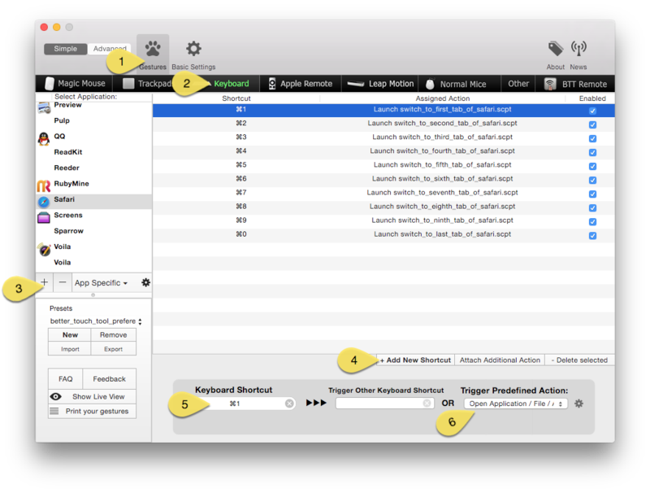

首先需要一个能够将快捷键绑定到一个 AppleScript 脚本的工具，这里以 [Better Touch Tool](http://www.bettertouchtool.net) 为例：

### 1. 打开 Script Editor.app，新建一个文稿，在新建的文稿中输入：

```AppleScript
tell front window of application "Safari" to set current tab to tab 1
```

将新建的文稿存储到某个固定的位置，如 `/Users/your_username/Documents/SafariTabSwitchers/1.scpt`。

以此类推新建 1 到 9 个脚本，分别对应 9 个快捷键。

另外也可以新建一个 0.scpt 脚本，将 ⌘ + 0 绑定为切换到最右边的标签页：

```AppleScript
tell front window of application "Safari" to set current tab to the last tab
```

### 2. 打开 Better Touch Tool 的设置面板：



如上图所示：

(1). 点击 Gestures 按钮  
(2). 然后点击 Keyboard 标签页  
(3). 再点击 `+` 号按钮，添加 Safari  
(4). 添加了 Safari 之后，点击面板右侧的 Add New Shortcut 按钮  
(5). 在 Keyboard Shortcut 处，按 ⌘ + 数字键  
(6). 在 Trigger Predefined Action 处选择“Open Aoolication / File / AppleScript”，然后选择在第一步中创建的脚本即可。  

